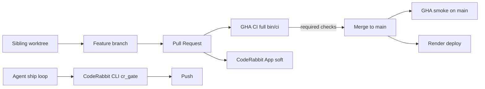

# GitHub / agent workflow modernization

**Date:** 2026-07-24  
**Status:** Approved for implementation planning  
**Surface:** gelbhart.dev (`gelbh/gelbhart-dev`, Rails 8 / Silicon / Bootstrap 5)  
**Reference kit:** `gelbh/jetlag` (adapted; not copied verbatim)

## Goal

Give gelbhart-dev the same durable ship loop as jetlag: sibling worktrees, PRs, thermos, CodeRabbit CLI merge gate, impeccable on UI changes, CI on PRs with a light main smoke, and a GitHub ruleset that gates merges — without ever committing Cursor/agent local kits.

## Decisions (locked)

| Topic | Choice |
|-------|--------|
| Scope | Rails-adapted jetlag parity (approach A) |
| Landing | One modernization PR + local-only agent bootstrap after merge |
| Git boundary | CI/review shared; agent kit local (shared `.gitignore`) |
| PR CI | Full suite shaped like `bin/ci` (required) |
| Main CI | Smoke only (RuboCop + `CI=true bin/test-changed`); not a ruleset check |
| CodeRabbit | Hybrid: soft PR App + CLI `cr_gate`; `request_changes_workflow: false` |
| CD | Unchanged Render on `main`; no GHA deploy |
| Human reviewers | Not required (solo) |
| README | Stay badge-minimal; do **not** mention `docs/superpowers/` |
| Spec location | `docs/superpowers/specs/` (existing project convention) |

## Out of scope

- Lighthouse as a required check
- Changesets / npm release train
- Sentry ship triage (no jetlag-style Sentry loop here)
- Firebase / Cloudflare Workers CD
- Committed `AGENTS.md`, `CLAUDE.md`, `.cursor/`, `.impeccable/`, `PRODUCT.md`, `DESIGN.md`
- Dependabot automerge workflow (optional later)
- Merge queue, CODEOWNERS, required human approvals
- README workflow documentation section

## Architecture

| Layer | Role |
|-------|------|
| Local agent kit | `.cursor/`, `.impeccable/`, `PRODUCT.md`, `DESIGN.md`, ship boards — **gitignored**. Thermos, impeccable, and `plan-thermos-ship` via **global** skills. |
| Committed quality surface | GHA workflows, `.coderabbit.yaml`, Dependabot, PR template, shared `.gitignore` excludes. |
| GitHub ruleset | `main`: PR-only, up-to-date branch, required status checks, no force-push/delete. |
| CD | Render continues to build/start from `main` (`render.yaml`). |

## Git boundary

### Shared `.gitignore` (promote from `.git/info/exclude`)

Must ignore:

- `.cursor/`
- `.impeccable/`
- `PRODUCT.md`
- `DESIGN.md`
- `AGENTS.md`
- `CLAUDE.md`

Also keep existing ignores (`.vscode/`, coverage, env files, etc.).

### Still allowed on git

- `.github/workflows/*`
- `.coderabbit.yaml`
- `.github/dependabot.yml`
- `.github/pull_request_template.md`
- `docs/superpowers/specs/` and `docs/superpowers/plans/` when intentionally written

`.github/copilot-instructions.md` remains local-only if presently excluded; do not add it in this pass.

## CI

### PR — `.github/workflows/ci.yml`

- **Triggers:** `pull_request` to `main`, `workflow_dispatch`
- **Concurrency:** cancel in-progress runs for the same PR
- **Permissions:** least privilege (`contents: read`, plus what jobs need)
- **Actions:** third-party actions pinned to commit SHAs (version tag in comment)
- **Runtime:** Ruby `3.3.10`, Node from `.node-version` (prefer aligning `.nvmrc` to the same major if touched), Postgres service, `bin/setup --skip-server` (or equivalent)

| Job | Command intent |
|-----|----------------|
| `lint` | `bin/rubocop`; `bin/importmap audit`; `bin/brakeman --quiet --no-pager --exit-on-warn --exit-on-error` |
| `test` | `CI=true bin/test-changed` (Rails + Jest; full suite when CI cannot map changes) |
| `system` | `bin/rails test:system` with Chrome/Selenium stack matching current gems |
| `seeds` | `RAILS_ENV=test bin/rails db:seed:replant` |

These four job names are the required status check contexts (plus existing GitGuardian).

### Main smoke — `.github/workflows/ci-main.yml`

- **Trigger:** `push` to `main`
- **Job:** RuboCop + `CI=true bin/test-changed` (no system suite)
- **Not** listed in the ruleset required checks (post-merge signal only)

## Ruleset

Create active ruleset `main-pr-required` on default branch (mirror jetlag):

- Require a pull request before merging
- Required status checks (strict / up-to-date): `lint`, `test`, `system`, `seeds`, `GitGuardian Security Checks`
- Block force pushes
- Block deletions
- Required approving review count: `0`
- No CODEOWNERS requirement

Apply via `gh` after the CI workflow exists on `main` so check names resolve. Open PR #2 (`feat/jetlag-portfolio`) must go green under the new checks before merge (workflow PR first, then refresh #2).

## CodeRabbit

### Committed `.coderabbit.yaml`

- Soft PR App: `request_changes_workflow: false`
- Assertive review profile; disable noisy pre-merge title/description/docstring checks (local commitlint covers conventions)
- Path filters for locks, coverage, builds, node_modules
- Instructions tuned for Rails 8 + Silicon/Bootstrap portfolio (bugs, security, a11y, theme-framework priority); path notes for `app/views/**`, `app/assets/stylesheets/**`, `app/javascript/**`, `test/**`

### CLI merge gate (process)

- Global ship skill / local gitignored coderabbit pointer
- Before every push: `coderabbit doctor` + `coderabbit review --base main --type committed --agent`
- Triage bugs/security/tests; skip style/false-positives with reason; re-run until clean → `cr_gate: ✅`
- Quota → `cr_gate: ⏭️` with note; do not wait on PR App `APPROVED`
- CodeRabbit is **not** a GitHub required status check

### Manual

Install CodeRabbit GitHub App on `gelbh/gelbhart-dev` if missing. After YAML is on `main`, verify with `@coderabbitai configuration`.

## Dependabot

`.github/dependabot.yml` weekly:

- `bundler` at `/`
- `npm` at `/`
- `github-actions` at `/`

Group minor/patch where Dependabot allows. No automerge workflow in this pass.

## PR template

`.github/pull_request_template.md` — thin Summary + Test plan checklist (jetlag-style).

## Local agent bootstrap (never git)

After the modernization PR merges, create locally only:

| Path | Purpose |
|------|---------|
| `.cursor/ship/` | `plan-thermos-ship` boards |
| `.cursor/rules/impeccable.mdc` | Globs: `app/views/**`, `app/assets/stylesheets/**`, `app/javascript/**` → global impeccable skill |
| `.cursor/skills/coderabbit/` (optional thin pointer) | Points at global CLI gate docs |
| Existing `.impeccable/`, `PRODUCT.md`, `DESIGN.md` | Stay local; now covered by shared `.gitignore` |

**Worktrees:** sibling directories `../gelbhart-dev-<slice>` (same pattern as `../jetlag-<slice>`).

**Ship loop:**

1. Slice → worktree → implement  
2. Thermos + impeccable when UI/views/CSS/JS change  
3. CLI `cr_gate` → push → PR CI green  
4. Merge → main smoke + Render → remove worktree  

## Failure behavior

| Failure | Effect |
|---------|--------|
| Any required PR job red | Merge blocked |
| CodeRabbit CLI unclean / `doctor` fail | Do not push (`⏭️` only on quota, noted on board) |
| Main smoke red | Fix-forward PR; Render may already be deploying |
| Render build fail | Ops fix-forward; not a GitHub required check |
| Agent paths staged | `.gitignore` blocks commit |

## Verification

1. No-op PR shows `lint`, `test`, `system`, `seeds`, and GitGuardian; ruleset blocks merge while red  
2. Direct push to `main` is rejected  
3. `git check-ignore` confirms `.cursor/`, `.impeccable/`, `PRODUCT.md`, `DESIGN.md`, `AGENTS.md`, `CLAUDE.md`  
4. `@coderabbitai configuration` confirms soft App + repo YAML  
5. README remains badge-minimal with no `docs/superpowers/` mention  

## Success criteria

- Merges to `main` impossible without green required PR checks  
- Cursor/agent local kits never appear in git history going forward  
- Ship process matches jetlag (worktrees, thermos, CR CLI, impeccable on UI) without committing that kit  
- Render remains the only production deploy path  

## Implementation note

Land as **one** modernization PR on a dedicated branch from `main` (do not fold into `feat/jetlag-portfolio`). After merge: enable ruleset, install CodeRabbit App if needed, bootstrap local `.cursor/` kit, then bring open PRs up to green.
