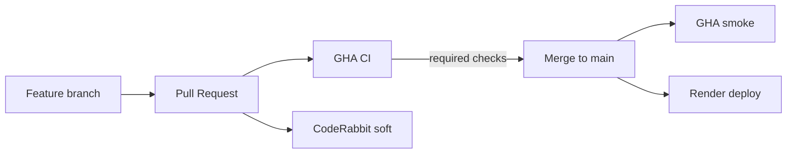

# GitHub workflow modernization

**Date:** 2026-07-24  
**Status:** Implemented  
**Surface:** gelbhart.dev (`gelbh/gelbhart-dev`, Rails 8)

## Goal

PR-gated quality checks on `main`, soft CodeRabbit reviews, Dependabot, and a GitHub ruleset — aligned with modern solo-app shipping (full suite on PRs, light smoke after merge, Render remains CD).

## Decisions

| Topic | Choice |
|-------|--------|
| PR CI | Full suite: `lint`, `test`, `system`, `seeds` (required) |
| Main CI | Smoke: RuboCop + `CI=true bin/test-changed` (not a ruleset check) |
| CodeRabbit | Soft PR App (`request_changes_workflow: false`) + optional CLI pre-push review |
| CD | Unchanged Render on `main` |
| Human reviewers | Not required |
| README | Badge-minimal; no workflow essay |

## Architecture

## CI

**PR** (`.github/workflows/ci.yml`): `lint` (RuboCop, importmap audit, Brakeman), `test` (Rails + Jest via `bin/test-changed`), `system`, `seeds`.

**Main** (`.github/workflows/ci-main.yml`): RuboCop + `bin/test-changed` only.

## Ruleset

`main-pr-required`: PR-only, up-to-date branch, required checks `lint` / `test` / `system` / `seeds` / `GitGuardian Security Checks`, block force-push and deletion.

## Supply chain

Dependabot weekly for `bundler`, `npm`, `github-actions`. Third-party Actions pinned to commit SHAs.
